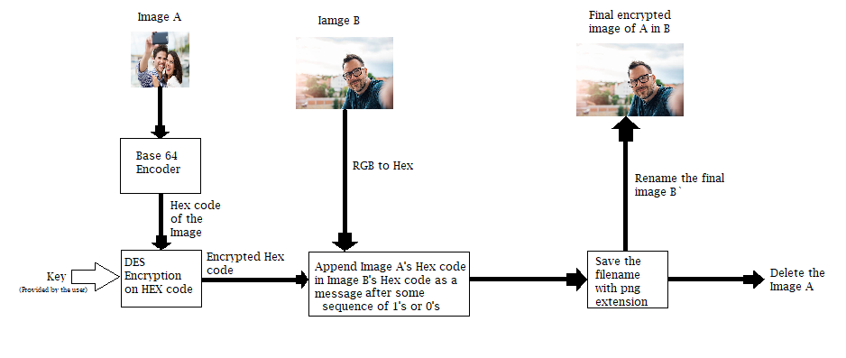
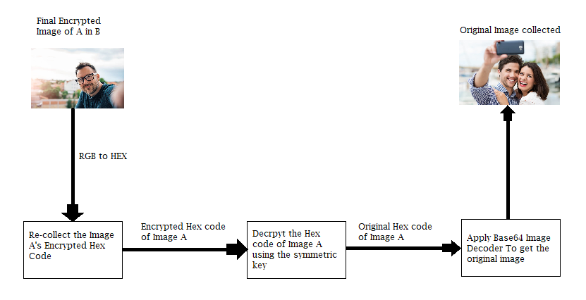

# E.T.I.S. - Encrypt The Image Safely

Applocks have been ruling the Image securing mehanisms for a decade now. The manufacturers have been implementing various cryptographic approaches to
make their applications more secure. But the question arises 

" Why to build such locks instead you can encrypt your images ? "

E.T.I.S. does the same for you. It takes an vital image of the user and encrypt it under an trivial image like it never existed, with no change to the latter one.

:point_right:Currently it is only an approach to encrypt your images in the PC, But later on full Android Application will be appended      plus anyone will be appretiated to implement it by his own.

## Getting Started :closed_lock_with_key:
If you wish to use E.T.I.S, just download the whole directory and follow the given steps

### Prerequisites
You need to have python installed on your PC. If you don't, you can install it here.
* [Python Latest Version :arrow_down:](https://www.python.org/downloads/)

E.T.I.S. have been compiled in Ubuntu OS using Python3.0 version, so if you are using different configurations make adjustments accordingly. Also make sure the extension of the image should be png.

### Mechanism of E.T.I.S.
E.T.I.S uses DES encryption at the back beacuse of its fast encryption rate and requires less memory space. You can read about [DES here](https://en.wikipedia.org/wiki/Data_Encryption_Standard). Consider Image A as an Important image, which need to be hide and Image B as an minor image with no importance.

The Encryption of the following program could be done as
```
python3 final_enc.py -e bunny.png
```
Following is the flow chart of the encryption in E.T.I.S



The Decryption of the following program could be done as
```
python3 final_dec.py -d bunny.png
```
The Decryption of the image is given in the below flow chart



The file named "conversion_in_python_2.0.py" will help the programmer to convert the python3.0 code to python2.0 code
